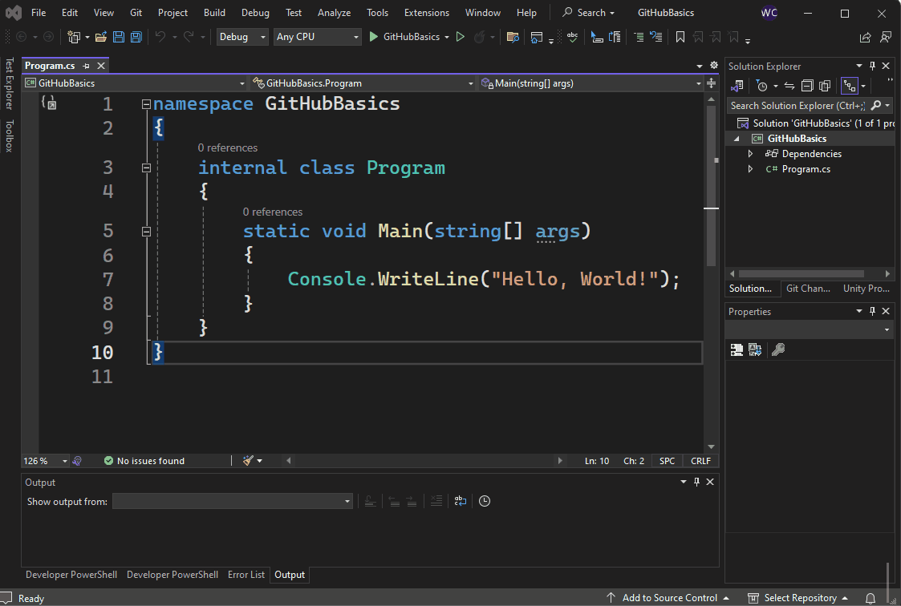
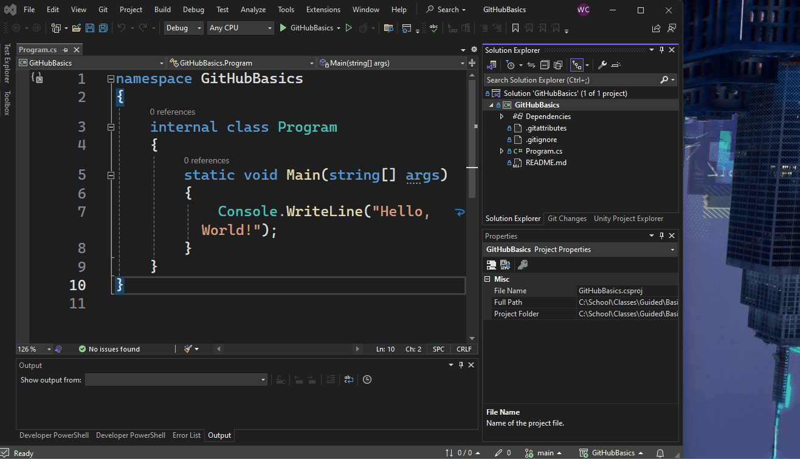
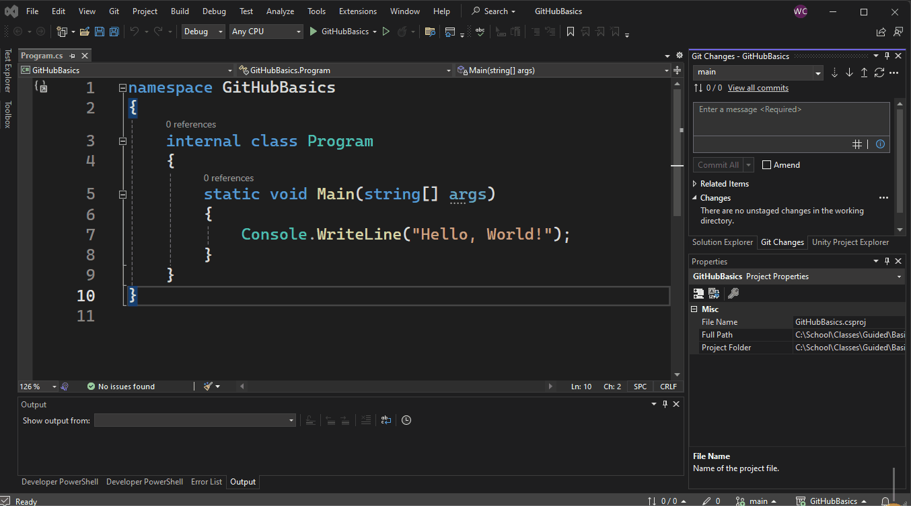
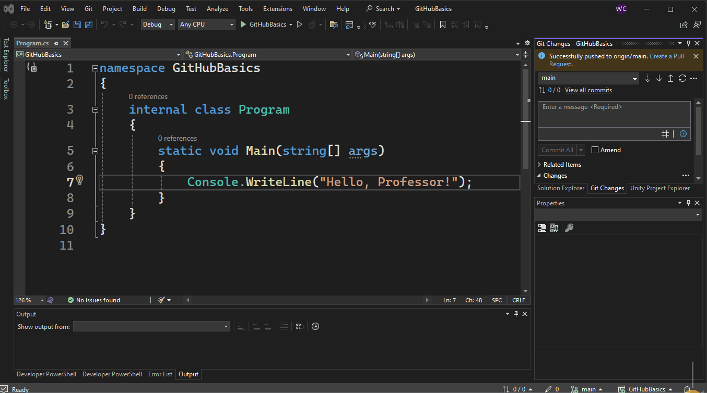
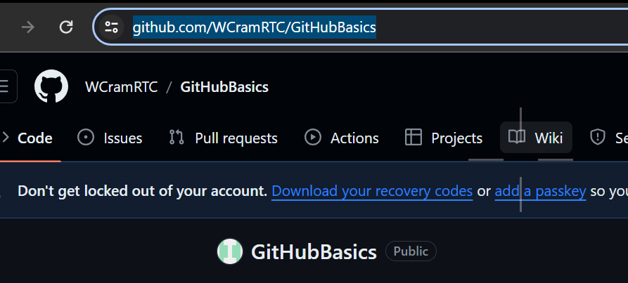

# Guided Assignment: Adding Git to a Project in Visual Studio

## Introduction
Git and GitHub are industry standard tools that let us backup our work online, collaborate with others around the world, and revert changes and test new features.

Git and GitHub can be complex when getting started, but we will use the basic functionality to save our projects online to gain experience.

---
## Requirements

1. Create a new console project, name GA_GitHub_Basics_***YourName***
2. Add Git to your project
    - Add a Readme File ( [x] Add README.md)
    - Make sure the repository is set to public ( [ ] Private Respository )
3. Check to see if your project was properly uploaded online
4. Change "Hello, World" to "Hello, Professor".
5. Save, Add Message, Commit, and Push.
6. Add another `Console.WriteLine("")` that says your name and what you want to learn to build in Computer Sciece.
7. Save, Add Message, Commit, and Push
8. Submit GitHub URL in the Assignment Submission Textbox
---
## Step By Step
# Adding Git to a Project in Visual Studio - Tutorial Summary

**Video Walkthough**   

### Step 1: Create a new Console Project named GH_GitBasics_***YourName***

---

### Step 2: Creating a Git Repository in Visual Studio:
- Go to the Git menu and select "Create Git Repository."
- In the creation window, check "Add README" for documentation and uncheck "Private Repository" for grading purposes.
- First-time users will need to sign in with their GitHub account.
- 

---

### Step 3: Pushing the Project Online:
- Creating the repository adds a README file and other files to the project.
- "Git Changes" view in Visual Studio helps track changes.
- "Open in Browser" from the Git menu verifies if the project is online on GitHub.

---

### Step 4: Making and Tracking Changes:
- Make a change to your `Program.cs` file.
- Change the message `Hello, World!` to `Hello, Professor!`
- Save changes made to the code. ( Hot key `Ctrl + S` )
- "Git Changes" window will show the tracked changes.

---

### Step 5: Committing and Pushing Changes:
- Enter a descriptive message in the "Git Changes" window.
- Click "Commit All" to backup changes.
- Use "Push" to update the project online on GitHub.
- 

---

### Step 7: Add another line. Save, Commit, Push
- Enter another `Console.WriteLine()`.
- Put your name and why you want to build in computer science
- Save
- Add Message
- Commit
- And Push

---

### Step 7: Submit YOUR Repository URL
- Go onto your repository online
- Copy the URL at the top of the web browser.
- Paste in the submission box on canvas

---

### Workflow Summary:
- Create a Git repository for each project, add a README, and make it public.
- Regularly commit changes with messages and push to GitHub.
- This process aids in backup, collaboration, and assignment submission.

---

## Rubric

| Step | Description | Points |
| ---- | ----------- | ------ |
| 1. Create Project | Create a new console project named GA_GitHub_Basics_***YourName***. | 10 |
| 2. Add Git to Project | Add Git to your project, include a README file, and ensure the repository is public. | 30 |
| 3. Check Project Online | Verify the project is uploaded online. (No points, but necessary step) | 0 |
| 4. Code Modification 1 | Change "Hello, World" to "Hello, Professor" in the code. | 15 |
| 5. First Commit and Push | Save changes, add a commit message, and push the update to GitHub. | 15 |
| 6. Code Modification 2 | Add another line using `Console.WriteLine("")` stating your name and what you want to learn in Computer Science. | 15 |
| 7. Second Commit and Push | Save changes, add a commit message, and push the update to GitHub. | 15 |
| 8. Submit GitHub URL | Submit the GitHub URL in the Assignment Submission Textbox. | 0 |

**Total Points: 100**